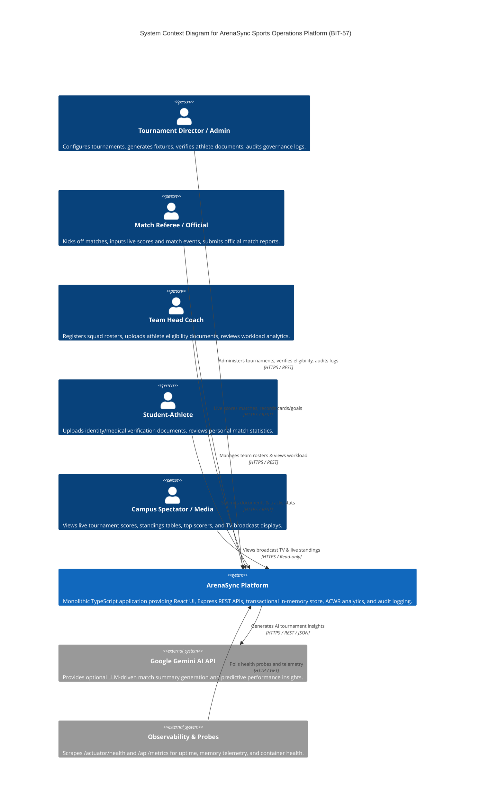
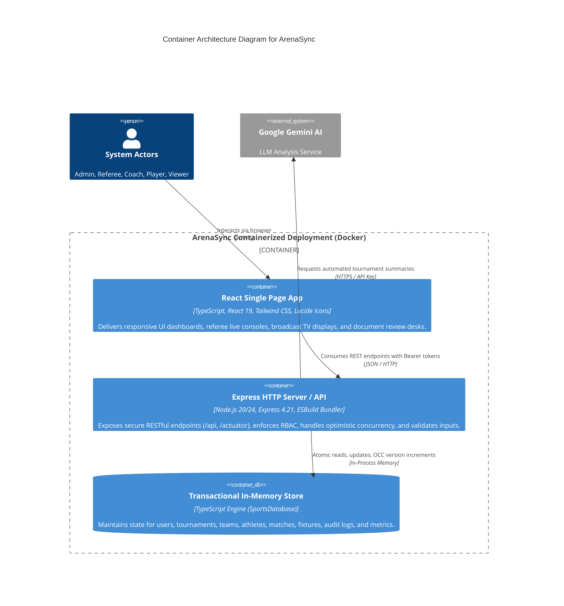
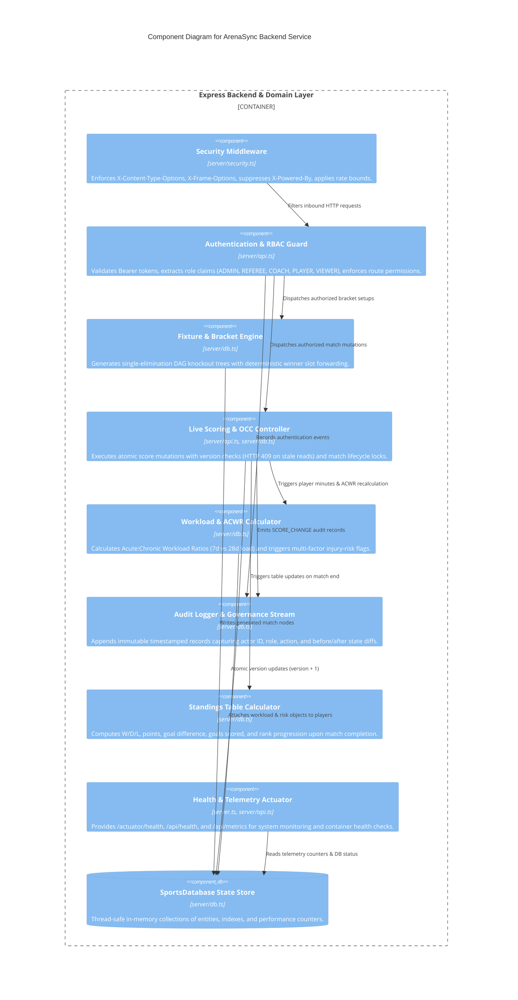

# ArenaSync — Architecture & C4 Design Specifications (BIT-57)

This document describes the concrete system architecture for **ArenaSync (BIT-57)** using the **C4 Model** (Context, Containers, Components).

---

## 1. C4 Level 1: System Context Diagram

The System Context diagram illustrates the human actors, their roles, and external evaluation/observability systems interacting with the ArenaSync boundary.

---

## 2. C4 Level 2: Container Architecture Diagram

The Container diagram illustrates the high-level technical building blocks that compose ArenaSync.

---

## 3. C4 Level 3: Component Architecture Diagram (Express Backend)

The Component diagram reveals the internal modular composition of the backend server layer (`server/api.ts`, `server/db.ts`, `server/security.ts`, `server.ts`).

