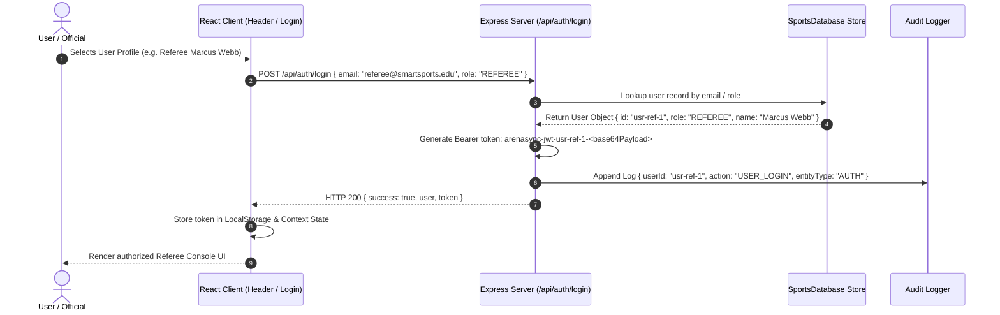
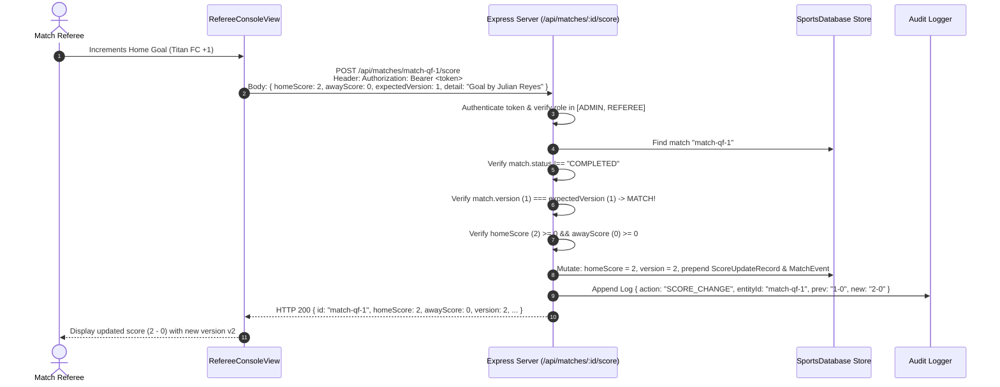
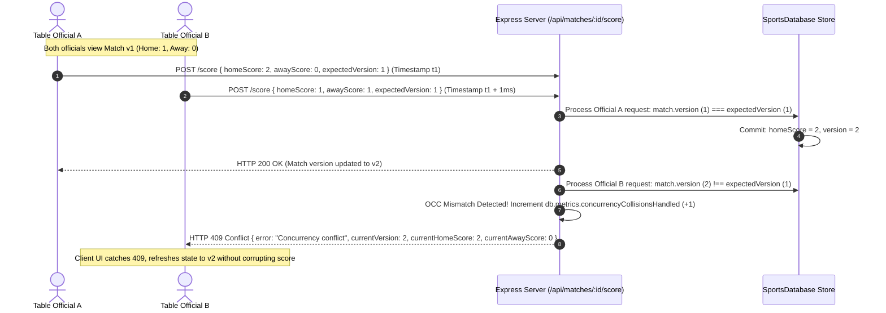
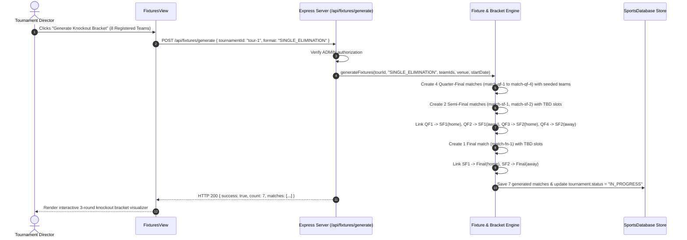
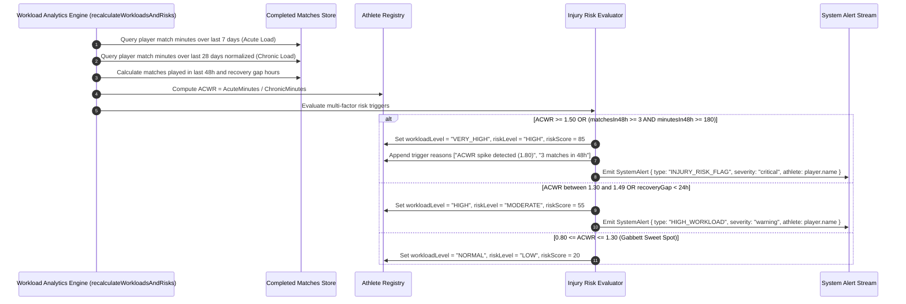

# ArenaSync — Data-Flow & Sequence Diagrams (BIT-57)

This document details the core data flows, state changes, and component interactions across the 6 primary business workflows in **ArenaSync**.

---

## Workflow A: User Authentication & Role Token Generation



---

## Workflow B: Live Score Update (Happy Path with Optimistic Lock Increment)



---

## Workflow C: Concurrent Score Update Collision Resulting in HTTP 409 Conflict



---

## Workflow D: Fixture Generation & Knockout Bracket Progression



---

## Workflow E: Workload Calculation (ACWR) → Statistical Injury-Risk Flag



---

## Workflow F: Immutable Audit Trail Logging

```mermaid
sequenceDiagram
    autonumber
    actor Admin as Admin Official
    participant Server as Express Server (/api/players/:id/documents/:docId/verify)
    participant DB as SportsDatabase
    participant Audit as AuditLog Stream

    Admin->>Server: PUT /api/players/p1/documents/doc-1/verify { status: "VERIFIED", notes: "Official ID Confirmed" }
    Server->>Server: Enforce ADMIN RBAC check
    Server->>DB: Update document status "PENDING" -> "VERIFIED"
    Server->>DB: Evaluate player eligibility (all documents VERIFIED -> player.eligibilityStatus = "VERIFIED")
    Server->>Audit: addAuditLog({<br/>  userId: "usr-admin-1",<br/>  userRole: "ADMIN",<br/>  action: "VERIFY_DOCUMENT",<br/>  entityType: "DOCUMENT",<br/>  entityId: "doc-1",<br/>  previousValue: "PENDING",<br/>  newValue: "VERIFIED - Player status: VERIFIED"<br/>})
    Audit->>Audit: Generate unique ID & ISO timestamp; prepend to immutable array (FIFO capped 200)
    Server-->>Admin: HTTP 200 { document: doc, playerEligibility: "VERIFIED" }
```
