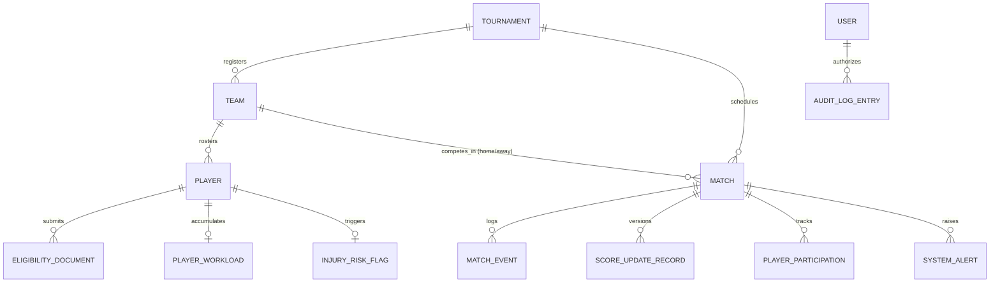
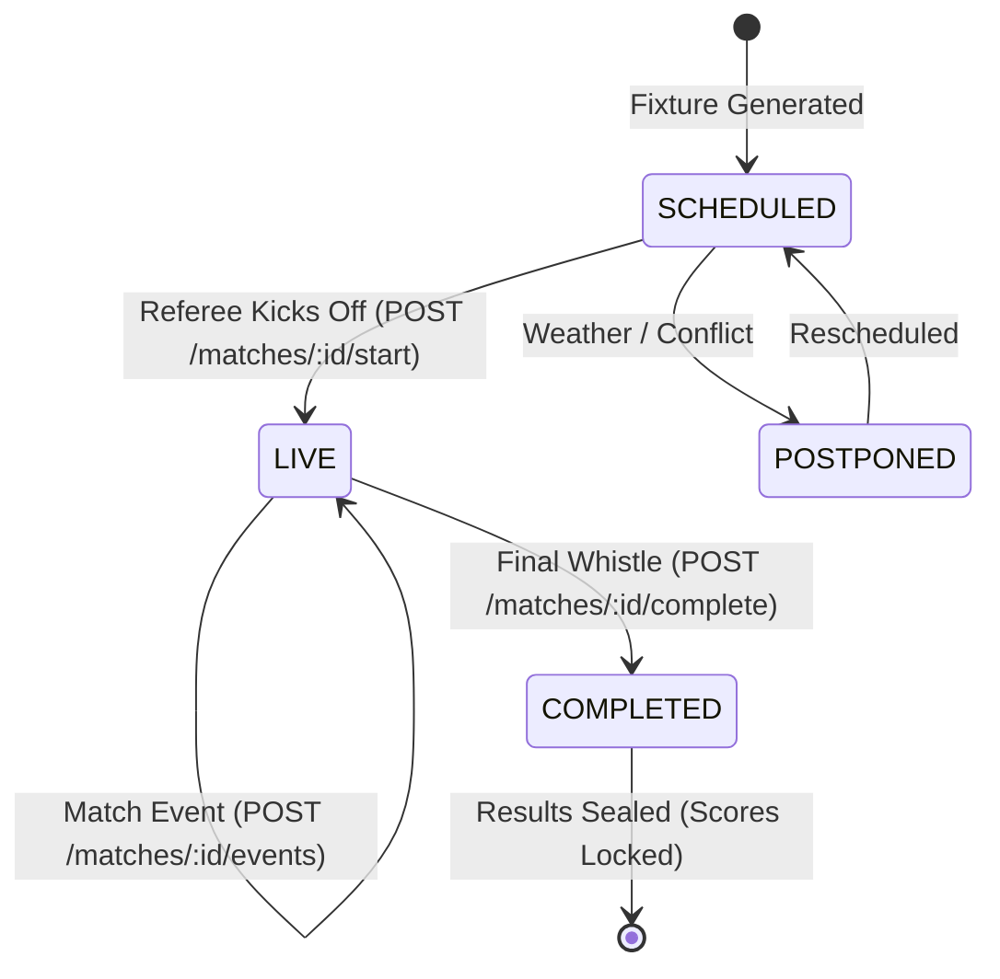
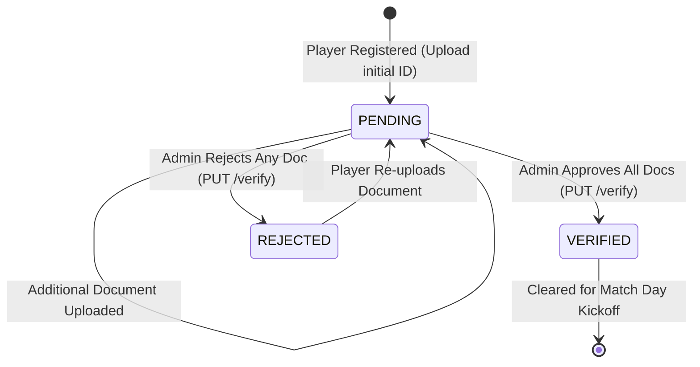
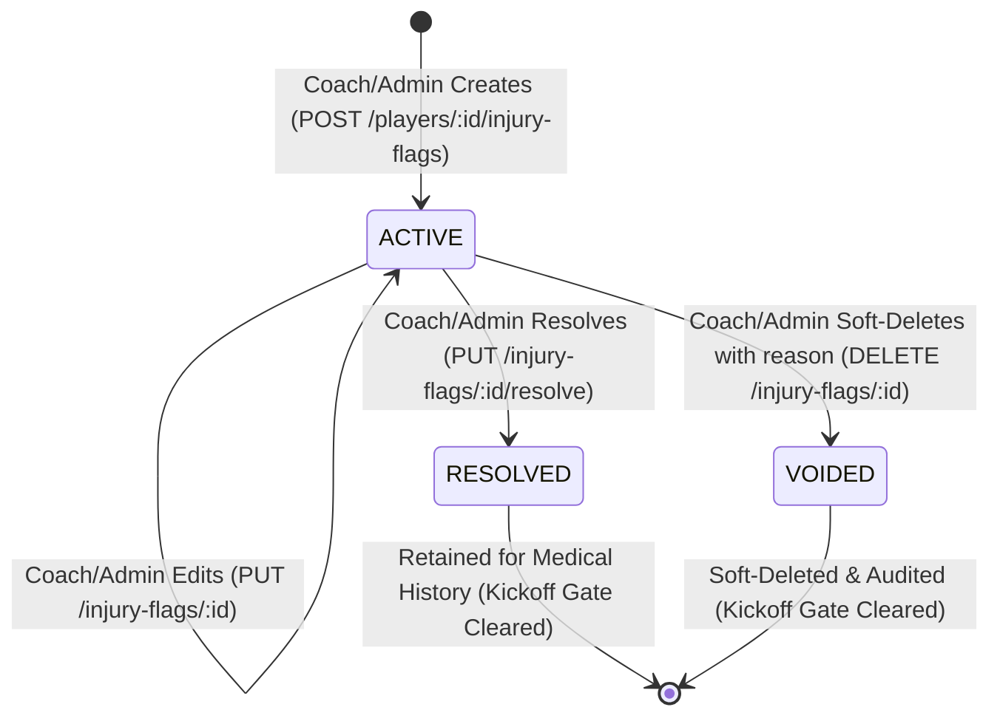

# ArenaSync — Domain Data Model & Schema Specifications (BIT-57)

This document provides the formal entity schema definitions, relational associations, primary identifiers, and lifecycle state machines implemented in **ArenaSync**.

---

## 1. Entity Relationship Model (ERD)

---

## 2. Entity Dictionary & Attributes

### 2.1. Tournament (`Tournament`)
* **Primary Key**: `id` (`string`, e.g., `tour-1`)
* **Attributes**:
  * `name`: Tournament title (`string`)
  * `sport`: Athletic discipline (`string`, e.g., `Football / Soccer`)
  * `format`: Tournament structure (`SINGLE_ELIMINATION` | `ROUND_ROBIN` | `GROUP_KNOCKOUT`)
  * `startDate` / `endDate`: ISO date bounds (`string`)
  * `venue`: Primary stadium / venue (`string`)
  * `numTeams`: Target team capacity (`number`, typically `8`)
  * `registeredTeamIds`: Array of enrolled team foreign keys (`string[]`)
  * `rules`: Official competition rules text (`string`)
  * `status`: Tournament lifecycle state (`DRAFT` | `REGISTRATION` | `IN_PROGRESS` | `COMPLETED` | `ARCHIVED`)
  * `championTeamId` / `championTeamName`: Winning team references (`string`, optional)

### 2.2. Team (`Team`)
* **Primary Key**: `id` (`string`, e.g., `team-1`)
* **Attributes**:
  * `name`: Official franchise name (`string`, e.g., `Titan FC`)
  * `code`: Unique 3-letter uppercase identifier (`string`, e.g., `TIT`)
  * `logoUrl`: Team crest image URL (`string`)
  * `coachName` / `coachEmail` / `coachId`: Head coach credentials (`string`)
  * `sport` / `homeVenue`: Home ground information (`string`)
  * `primaryColor` / `secondaryColor`: Hexadecimal branding colors (`string`)
  * `matchesPlayed` / `wins` / `losses` / `draws` / `points`: Season records (`number`)
  * `goalsFor` / `goalsAgainst` / `goalDifference`: Scoring differentials (`number`)
  * `recentForm`: Historical form window (`('W' | 'D' | 'L')[]`)
  * `status`: Operational state (`ACTIVE` | `PENDING` | `INACTIVE`)

### 2.3. Player / Student-Athlete (`Player`)
* **Primary Key**: `id` (`string`, e.g., `ply-101`)
* **Attributes**:
  * `playerId`: Student sports registration ID (`string`, e.g., `PLY-1001`)
  * `name`: Athlete full name (`string`)
  * `teamId` / `teamName`: Franchise association foreign key (`string`)
  * `jerseyNumber`: Squad kit number (`number`)
  * `position`: Positional role (`string`, e.g., `Midfielder`, `Striker`)
  * `age`: Athlete age (`number`)
  * `contactEmail` / `contactPhone`: Contact details (`string`)
  * `eligibilityStatus`: Overall verification gate (`PENDING` | `VERIFIED` | `REJECTED`)
  * `documents`: Collection of uploaded clearance certificates (`EligibilityDocument[]`)
  * `matchesPlayed` / `minutesPlayed` / `goals` / `assists` / `yellowCards` / `redCards` / `fouls` / `rating`: Performance metrics (`number`)
  * `workload`: Attached dynamic ACWR workload object (`PlayerWorkload`, optional)
  * `injuryRisk`: Attached statistical fatigue risk flag (`InjuryRiskFlag`, optional)

### 2.4. Eligibility Document (`EligibilityDocument`)
* **Primary Key**: `id` (`string`, e.g., `doc-101`)
* **Attributes**:
  * `playerId`: Athlete foreign key (`string`)
  * `documentType`: Certificate classification (`COLLEGE_ID` | `ID_PROOF` | `MEDICAL_CERTIFICATE` | `REGISTRATION_DOC`)
  * `fileName` / `fileSize` / `uploadDate`: File metadata (`string`)
  * `status`: Verification status (`PENDING` | `VERIFIED` | `REJECTED`)
  * `verifiedDate` / `verifiedBy`: Reviewer credentials and timestamp (`string`, optional)
  * `notes`: Administrative review notes (`string`, optional)

### 2.5. Match / Fixture (`Match`)
* **Primary Key**: `id` (`string`, e.g., `match-qf-1`)
* **Attributes**:
  * `tournamentId` / `tournamentName`: Tournament foreign key (`string`)
  * `roundName`: Round label (`string`, e.g., `Quarter-Final 1`, `Semi-Final 1`, `Championship Final`)
  * `roundIndex`: Topological depth (`number`: 1=QF, 2=SF, 3=Final)
  * `homeTeamId` / `homeTeamName` / `homeTeamLogo`: Home team descriptors
  * `awayTeamId` / `awayTeamName` / `awayTeamLogo`: Away team descriptors
  * `homeScore` / `awayScore`: Live match scoreline (`number`)
  * `date` / `time` / `venue`: Scheduling specifications (`string`)
  * `refereeId` / `refereeName`: Assigned match official credentials (`string`, optional)
  * `status`: Match lifecycle state (`SCHEDULED` | `LIVE` | `COMPLETED` | `CANCELLED` | `POSTPONED`)
  * `currentMinute` / `period`: In-game clock & half (`number` / `string`)
  * `events`: Chronological incident stream (`MatchEvent[]`)
  * `scoreUpdates`: Historical score mutation audit records (`ScoreUpdateRecord[]`)
  * `playerParticipations`: Lineup minutes & disciplinary statistics (`PlayerParticipation[]`)
  * `refereeReportSubmitted` / `refereeNotes`: Post-match sign-off (`boolean` / `string`)
  * `winnerTeamId`: Advancing team reference (`string`, optional)
  * `version`: Atomic optimistic locking version counter (`number`, starts at 1)
  * `nextMatchId`: Directed bracket graph forward pointer (`string`, optional)
  * `nextMatchSlot`: Seed slot in downstream fixture (`home` | `away`, optional)

### 2.6. User (`User`)
* **Primary Key**: `id` (`string`, e.g., `usr-admin-1`, `usr-ref-1`)
* **Attributes**:
  * `name`: Full user name (`string`)
  * `email`: Institutional email address (`string`)
  * `role`: RBAC Security role (`ADMIN` | `REFEREE` | `COACH` | `PLAYER` | `VIEWER`)
  * `teamId`: Associated franchise for coaches/players (`string`, optional)
  * `assignedMatchIds`: Match IDs assigned to referee (`string[]`, optional)

### 2.7. Injury Risk Flag (`InjuryRiskFlag`)
* **Primary Key**: `id` (`string`, e.g., `flag-auto-ply-1`, `flag-man-1789994580-x9a`)
* **Attributes**:
  * `playerId`: Associated athlete ID (`string`)
  * `playerName` / `teamId` / `teamName`: Athlete descriptors (`string`)
  * `source`: Provenance of flag (`ACWR_AUTO` | `MANUAL`)
  * `category`: Classification category (`INJURY` | `ILLNESS` | `SUSPENSION`)
  * `severity`: Clinical / operational severity (`LOW` | `MODERATE` | `HIGH`)
  * `riskLevel`: Risk tier indicator (`LOW` | `MODERATE` | `HIGH`, backward compatible)
  * `notes`: Technical staff or system assessment notes (max 500 characters, `string`)
  * `status`: Operational lifecycle status (`ACTIVE` | `RESOLVED` | `VOIDED`)
  * `createdBy` / `createdAt`: Originator username/ID and ISO 8601 creation timestamp (`string`)
  * `updatedBy` / `updatedAt`: Last modifying user and timestamp (`string`, optional)
  * `resolvedBy` / `resolvedAt`: Resolving practitioner/coach and timestamp (`string`, optional)
  * `voidedBy` / `voidedAt` / `voidReason`: Soft-delete audit actor, timestamp, and required reason (`string`, optional)
  * `reasons` / `riskScore` / `triggers` / `disclaimer` / `lastCalculated`: Mathematical workload descriptors (for ACWR auto models)

### 2.8. Audit Log Entry (`AuditLogEntry`)
* **Primary Key**: `id` (`string`, e.g., `log-1789994580-x9a`)
* **Attributes**:
  * `timestamp`: ISO 8601 creation timestamp (`string`)
  * `userId` / `userName` / `userRole`: Originating actor identity
  * `action`: Action classification (`string`, e.g., `SCORE_CHANGE`, `VERIFY_DOCUMENT`, `USER_LOGIN`, `ADD_INJURY_FLAG`, `UPDATE_INJURY_FLAG`, `RESOLVE_INJURY_FLAG`, `VOID_INJURY_FLAG`)
  * `entityType`: Target entity category (`TOURNAMENT` | `TEAM` | `PLAYER` | `DOCUMENT` | `FIXTURE` | `MATCH` | `SCORE` | `AUTH` | `RISK_FLAG`)
  * `entityId`: Unique identifier of modified entity (`string`)
  * `previousValue` / `newValue`: Before/after delta tracking (`string`, optional)
  * `notes`: Additional administrative context (`string`, optional)

---

## 3. Lifecycle State Machines

### 3.1. Match Lifecycle State Transitions

### 3.2. Athlete Eligibility State Machine

### 3.3. Manual Injury / Suspension Flag Lifecycle

