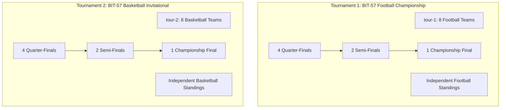

# ArenaSync (BIT-57) — Synthetic Seed Data Package Specification

This document details the provenance, entity schema dictionary, versioning, privacy governance, and regeneration workflow for the synthetic seed data package (`data/seed-v1.json`) powering **ArenaSync**.

---

## 1. Overview & Data Provenance

ArenaSync utilizes a deterministic, script-generated synthetic data package to evaluate tournament operations, optimistic concurrency control, bracket progression, and Acute:Chronic Workload Ratio (ACWR) modeling across multiple collegiate sports disciplines.

* **Provenance**: 100% Synthetic and procedurally generated via algorithmic script.
* **Deterministic PRNG**: Seeded `Mulberry32` pseudo-random number generator ensuring exact byte-for-byte reproducibility across runs.
* **Generator Source**: [`scripts/generate-seed-data.js`](file:///c:/Users/Priya%20Yadav/Downloads/ArenaSync-BIT57-main/ArenaSync-BIT57-main/scripts/generate-seed-data.js)
* **Target Output**: [`data/seed-v1.json`](file:///c:/Users/Priya%20Yadav/Downloads/ArenaSync-BIT57-main/ArenaSync-BIT57-main/data/seed-v1.json)
* **Database Ingestion**: Loaded automatically by [`SportsDatabase.seedInitialData()`](file:///c:/Users/Priya%20Yadav/Downloads/ArenaSync-BIT57-main/ArenaSync-BIT57-main/server/db.ts) on system initialization.

---

## 2. Dataset Metadata & Versioning

| Property | Value | Description |
| :--- | :--- | :--- |
| **Package Version** | `1.0.0` | Initial release of multi-sport tournament seed |
| **Generated Timestamp** | `2026-09-20T00:00:00.000Z` | Standard baseline reference timestamp |
| **PRNG Seed** | `42` | Fixed seed integer for deterministic outputs |
| **Active Tournaments** | `2` | Football Premier Championship & Basketball Invitational |
| **Total Teams** | `16` | 8 Football clubs (`team-1`..`8`), 8 Basketball clubs (`team-b1`..`b8`) |
| **Total Student-Athletes** | `91` | 11 Football players + 80 Basketball players (10 per team) |
| **Total Knockout Fixtures**| `14` | 7 Football matches + 7 Basketball matches |
| **Storage Format** | JSON (UTF-8) | Serialized structured object |

---

## 3. Data Dictionary

### 3.1. Tournament (`Tournament`)
Defines the championship competition parameters, sport discipline, and registered teams.

| Field | Type | Constraints | Description |
| :--- | :--- | :--- | :--- |
| `id` | `string` | Unique PK (e.g. `tour-1`, `tour-2`) | Unique tournament identifier |
| `name` | `string` | Non-empty | Tournament official title |
| `sport` | `string` | e.g., `Football / Soccer`, `Basketball` | Athletic sport category |
| `format` | `TournamentFormat` | `SINGLE_ELIMINATION` \| `ROUND_ROBIN` \| `GROUP_KNOCKOUT` | Tournament format |
| `startDate` | `string` | ISO Date (`YYYY-MM-DD`) | Competition opening date |
| `endDate` | `string` | ISO Date (`YYYY-MM-DD`) | Championship final date |
| `venue` | `string` | Non-empty | Main tournament venue / arena complex |
| `numTeams` | `number` | Fixed to `8` | Team bracket capacity |
| `registeredTeamIds` | `string[]` | Array of 8 Team PKs | Foreign keys of enrolled teams |
| `rules` | `string` | Text | Sport-specific regulation summary |
| `status` | `TournamentStatus`| `DRAFT` \| `REGISTRATION` \| `IN_PROGRESS` \| `COMPLETED` | Lifecycle state |
| `bannerUrl` | `string` | URL | Hero banner image link |

### 3.2. Team (`Team`)
Represents an enrolled collegiate sports franchise.

| Field | Type | Constraints | Description |
| :--- | :--- | :--- | :--- |
| `id` | `string` | Unique PK (e.g. `team-1`, `team-b1`) | Unique team identifier |
| `name` | `string` | Unique string | Official franchise name |
| `code` | `string` | 3-letter uppercase code | Unique team code (e.g., `TIT`, `CBK`) |
| `logoUrl` | `string` | URL | Crest/logo visual asset |
| `coachName` | `string` | Non-empty | Head coach name |
| `coachEmail` | `string` | Valid email format | Official contact email |
| `sport` | `string` | Matches tournament sport | Sport classification |
| `homeVenue` | `string` | Non-empty | Home stadium / court |
| `primaryColor` | `string` | Hex color (`#RRGGBB`) | Primary branding color |
| `secondaryColor` | `string` | Hex color (`#RRGGBB`) | Secondary accent color |
| `matchesPlayed` | `number` | $\ge 0$ | Cumulative matches played |
| `wins` / `losses` / `draws` | `number` | $\ge 0$ | Win-Loss-Draw record |
| `points` | `number` | $\ge 0$ | Table points (Win=3, Draw=1, Loss=0) |
| `goalsFor` / `goalsAgainst` | `number` | $\ge 0$ | Scored and conceded goals/points |
| `goalDifference` | `number` | Integer | Net differential ($GF - GA$) |
| `recentForm` | `('W' \| 'D' \| 'L')[]` | Max length 5 | Last 5 match results |
| `status` | `string` | `ACTIVE` \| `PENDING` \| `INACTIVE` | Team operational status |

### 3.3. Player / Student-Athlete (`Player`)
Represents a student-athlete rostered on a collegiate team.

| Field | Type | Constraints | Description |
| :--- | :--- | :--- | :--- |
| `id` | `string` | Unique PK (e.g., `ply-1`, `ply-b-1-1`) | Internal system player ID |
| `playerId` | `string` | Format `PLY-XXXX` / `PLY-BXXXX` | Collegiate athletic registration ID |
| `name` | `string` | Synthetic fictional name | Athlete full name |
| `teamId` | `string` | Team FK | Rostered team identifier |
| `teamName` | `string` | Team descriptor | Rostered team name |
| `jerseyNumber` | `number` | 0 – 99 | Squad kit number |
| `position` | `string` | Sport-specific position | Playing position (e.g., `Point Guard`, `Striker`) |
| `age` | `number` | 18 – 25 | Athlete collegiate age |
| `contactEmail` | `string` | Synthetic `.edu` email | Athlete university contact email |
| `contactPhone` | `string` | `+1 (555) XXX-XXXX` | Athlete contact phone |
| `eligibilityStatus` | `EligibilityStatus` | `VERIFIED` \| `PENDING` \| `REJECTED` | Computed overall eligibility gate |
| `documents` | `EligibilityDocument[]` | Array of documents | Submitted clearance certificates |
| `matchesPlayed` | `number` | $\ge 0$ | Season tournament appearances |
| `minutesPlayed` | `number` | $\ge 0$ | Total on-court / on-pitch minutes |
| `goals` | `number` | $\ge 0$ | Goals (Football) or Points (Basketball) |
| `assists` | `number` | $\ge 0$ | Assisted scoring plays |
| `yellowCards` / `redCards` | `number` | $\ge 0$ | Disciplinary cards |
| `fouls` | `number` | $\ge 0$ | Personal fouls committed |
| `rating` | `number` | 0.0 – 10.0 | Algorithmic performance rating |
| `workload` | `PlayerWorkload` | Optional object | Dynamic ACWR and training load breakdown |
| `injuryRisk` | `InjuryRiskFlag` | Optional object | Statistical workload fatigue indicator |

### 3.4. Eligibility Document (`EligibilityDocument`)
Clearance certificates required for match participation.

| Field | Type | Constraints | Description |
| :--- | :--- | :--- | :--- |
| `id` | `string` | Unique PK (e.g., `doc-1`, `doc-b-101`) | Document identifier |
| `playerId` | `string` | Player FK | Athlete identifier |
| `documentType` | `DocumentType` | `COLLEGE_ID` \| `MEDICAL_CERTIFICATE` \| `REGISTRATION_DOC` | Document category |
| `fileName` | `string` | e.g., `smith_student_id.pdf` | Uploaded document filename |
| `fileSize` | `string` | e.g., `1.2 MB` | File payload size |
| `uploadDate` | `string` | ISO Date | Submission date |
| `status` | `DocumentStatus` | `VERIFIED` \| `PENDING` \| `REJECTED` | Document verification status |
| `verifiedDate` | `string` | ISO Date (optional) | Date reviewer signed off |
| `verifiedBy` | `string` | Reviewer name (optional) | Administrator / medical official |
| `notes` | `string` | Text (optional) | Verification notes or rejection reasons |

### 3.5. Match / Fixture (`Match`)
Knockout fixtures organized in a 7-match single elimination topological bracket.

| Field | Type | Constraints | Description |
| :--- | :--- | :--- | :--- |
| `id` | `string` | Unique PK (e.g., `match-qf-1`, `match-b-sf-1`) | Match identifier |
| `tournamentId` | `string` | Tournament FK (`tour-1` or `tour-2`) | Associated tournament |
| `roundName` | `string` | `Quarter-Final X` \| `Semi-Final X` \| `Championship Final` | Round description |
| `roundIndex` | `number` | `1` (QF), `2` (SF), `3` (Final) | Bracket topological level |
| `matchNumber` | `number` | 1 – 7 | Match sequence within bracket |
| `homeTeamId` / `awayTeamId` | `string` | Team FK or empty for TBD | Competing teams |
| `homeScore` / `awayScore` | `number` | $\ge 0$ | Current scoreline |
| `status` | `MatchStatus` | `SCHEDULED` \| `LIVE` \| `COMPLETED` | Fixture lifecycle state |
| `currentMinute` | `number` | Game clock minute | In-game clock |
| `period` | `string` | `Pre-Match` \| `1st Half` \| `3rd Quarter` \| `Full-Time` | Current game period |
| `events` | `MatchEvent[]` | Array of incidents | Chronological event stream |
| `scoreUpdates` | `ScoreUpdateRecord[]` | Array of updates | Historical score changes |
| `playerParticipations` | `PlayerParticipation[]` | Array of player lines | Match minutes & player stats |
| `version` | `number` | Atomic counter ($\ge 1$) | Optimistic concurrency control lock |
| `nextMatchId` | `string` | Match FK (optional) | Topological next match pointer |
| `nextMatchSlot` | `string` | `'home'` \| `'away'` (optional) | Bracket slot in next match |

---

## 4. Multi-Tournament Architecture & Independence

ArenaSync natively supports concurrent, multi-sport tournaments:



### Standings Isolation
- Standings calculation filters strictly by the `registeredTeamIds` associated with the requested `tournamentId`.
- Match results, scoring, and point accumulation in `tour-1` have zero side-effects on `tour-2` standings and vice versa.

---

## 5. Privacy & Ethics Statement

> [!IMPORTANT]
> **100% Synthetic Data Declaration**
> All person names, email addresses, phone numbers, athletic statistics, document filenames, and team records in `data/seed-v1.json` are **entirely fictional and procedurally generated**.
>
> - **No Real Persons**: No living individuals, real-world collegiate athletes, coaches, or referees are depicted.
> - **No Real PII**: No authentic personally identifiable information (PII), medical records, student IDs, or contact numbers exist in this repository.
> - **Compliance**: Complies with synthetic data privacy guidelines for open evaluation, benchmarking, and demonstration purposes.

---

## 6. Regeneration & Verification Steps

To regenerate the seed dataset from scratch deterministically:

### Step 1: Run Seed Generator
```bash
npm run seed:generate
```
*Output*: Overwrites [`data/seed-v1.json`](file:///c:/Users/Priya%20Yadav/Downloads/ArenaSync-BIT57-main/ArenaSync-BIT57-main/data/seed-v1.json) with identical deterministic data using seed `42`.

### Step 2: Execute Test Suite
```bash
npm test
```
*Verification*: Validates all 51 test cases across 11 test suites (including multi-tournament existence, 8-team rosters, 7-match bracket topology, and standings isolation).

### Step 3: Run TypeScript Type Check
```bash
npm run lint
```
*Verification*: Confirms type safety and zero TypeScript compiler diagnostic errors (`tsc --noEmit`).
