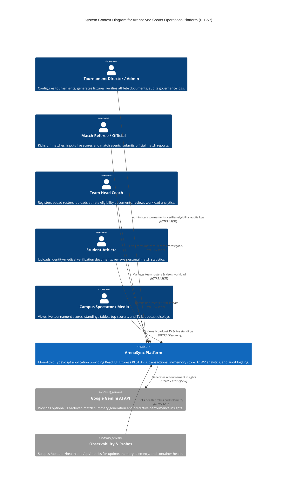
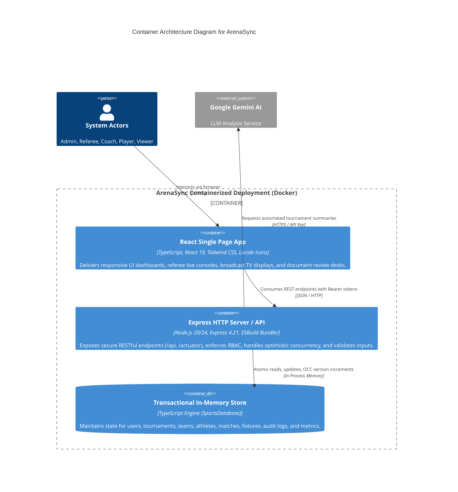
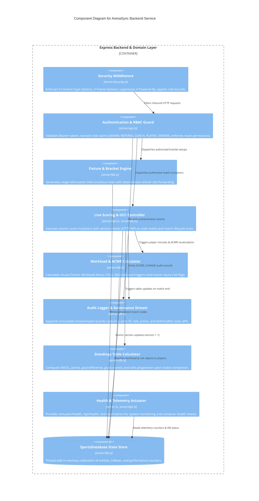
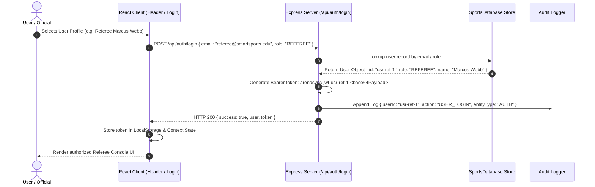
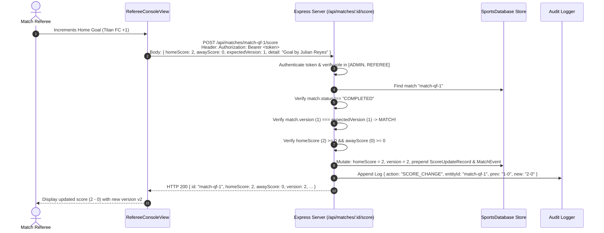
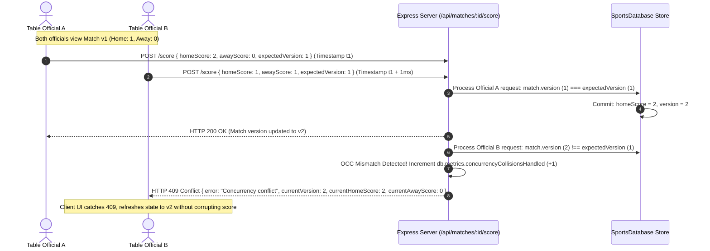
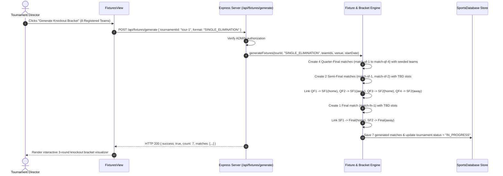
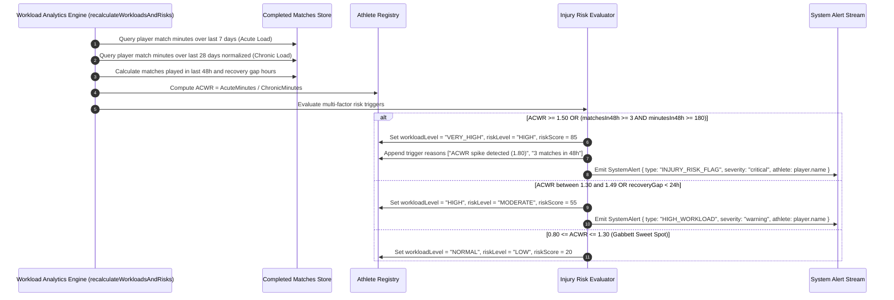
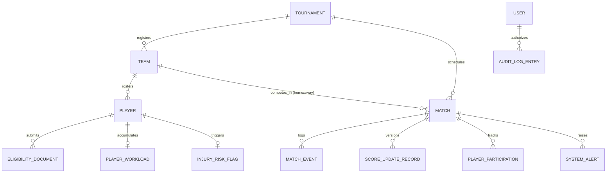

# ArenaSync — Comprehensive Solution Design Pack (BIT-57)

**Project Title**: ArenaSync — Intelligent Sports Tournament Operations & Analytics Platform  
**Capstone Code**: BIT-57  
**Degree Program**: Bachelor of Science in Information Technology (B.Sc. IT)  
**Document Version**: 1.0 (Production & Academic Capstone Release)  
**Evaluation Date**: 2026-09-21  

---

## 1. System Overview

**ArenaSync** is an enterprise-grade, intelligent sports tournament operations, live scoring, and athlete workload analytics platform developed for collegiate and institutional athletic departments.

The platform addresses the severe operational hazards identified in the **BIT-57 problem statement**—including fixture mispairings, uncoordinated live score race conditions, lack of accountability in athlete eligibility verification, and unmonitored athletic fatigue accumulation.

ArenaSync unifies the end-to-end tournament lifecycle into a reactive, high-performance platform:
$$\text{Registration} \longrightarrow \text{Eligibility Desk} \longrightarrow \text{Fixture Engine} \longrightarrow \text{Live Scoring \& OCC} \longrightarrow \text{Standings} \longrightarrow \text{ACWR Analytics} \longrightarrow \text{Injury Flags} \longrightarrow \text{Audit Trail}$$

---

## 2. System Architecture & C4 Model

### 2.1. C4 Level 1: System Context Diagram



### 2.2. C4 Level 2: Container Architecture Diagram



### 2.3. C4 Level 3: Backend Component Architecture Diagram



---

## 3. Data-Flow & Sequence Diagrams

### 3.1. User Authentication & Role Token Issuance


### 3.2. Live Score Update (Optimistic Locking Commit)


### 3.3. Concurrent Score Update Collision (`HTTP 409 Conflict`)


### 3.4. Fixture Generation & Knockout Bracket Progression


### 3.5. Workload Calculation (ACWR) → Statistical Injury Risk Flags


### 3.6. Immutable Audit Trail Logging
```mermaid
sequenceDiagram
    autonumber
    actor Admin as Admin Official
    participant Server as Express Server (/api/players/:id/documents/:docId/verify)
    participant DB as SportsDatabase
    participant Audit as AuditLog Stream

    Admin->>Server: PUT /api/players/p1/documents/doc-1/verify { status: "VERIFIED", notes: "Official ID Confirmed" }
    Server->>Server: Enforce ADMIN RBAC check
    Server->>DB: Update document status "PENDING" -> "VERIFIED"
    Server->>DB: Evaluate player eligibility (all documents VERIFIED -> player.eligibilityStatus = "VERIFIED")
    Server->>Audit: addAuditLog({<br/>  userId: "usr-admin-1",<br/>  userRole: "ADMIN",<br/>  action: "VERIFY_DOCUMENT",<br/>  entityType: "DOCUMENT",<br/>  entityId: "doc-1",<br/>  previousValue: "PENDING",<br/>  newValue: "VERIFIED - Player status: VERIFIED"<br/>})
    Audit->>Audit: Generate unique ID & ISO timestamp; prepend to immutable array (FIFO capped 200)
    Server-->>Admin: HTTP 200 { document: doc, playerEligibility: "VERIFIED" }
```

---

## 4. Domain Data Model & Entity Schema



### Entity Dictionary Summary
* **`Tournament`**: `id`, `name`, `sport`, `format` (`SINGLE_ELIMINATION` | `ROUND_ROBIN`), `startDate`, `endDate`, `venue`, `numTeams`, `registeredTeamIds`, `rules`, `status` (`DRAFT` | `REGISTRATION` | `IN_PROGRESS` | `COMPLETED`), `championTeamId`.
* **`Team`**: `id`, `name`, `code` (unique 3-letter uppercase), `logoUrl`, `coachName`, `coachEmail`, `coachId`, `sport`, `homeVenue`, `primaryColor`, `secondaryColor`, `matchesPlayed`, `wins`, `losses`, `draws`, `points`, `goalsFor`, `goalsAgainst`, `goalDifference`, `recentForm`, `status`.
* **`Player`**: `id`, `playerId` (e.g. `PLY-1001`), `name`, `teamId`, `teamName`, `jerseyNumber`, `position`, `age`, `contactEmail`, `contactPhone`, `photoUrl`, `eligibilityStatus` (`PENDING` | `VERIFIED` | `REJECTED`), `documents`, `workload`, `injuryRisk`, performance stats.
* **`EligibilityDocument`**: `id`, `playerId`, `documentType` (`COLLEGE_ID` | `ID_PROOF` | `MEDICAL_CERTIFICATE` | `REGISTRATION_DOC`), `fileName`, `fileSize`, `uploadDate`, `status` (`PENDING` | `VERIFIED` | `REJECTED`), `verifiedDate`, `verifiedBy`, `notes`.
* **`Match`**: `id`, `tournamentId`, `roundName`, `roundIndex`, `homeTeamId`, `homeTeamName`, `awayTeamId`, `awayTeamName`, `homeScore`, `awayScore`, `date`, `time`, `venue`, `refereeId`, `status` (`SCHEDULED` | `LIVE` | `COMPLETED`), `currentMinute`, `period`, `events`, `scoreUpdates`, `playerParticipations`, `version` (atomic OCC integer), `nextMatchId`, `nextMatchSlot`.
* **`AuditLogEntry`**: `id`, `timestamp`, `userId`, `userName`, `userRole`, `action`, `entityType`, `entityId`, `previousValue`, `newValue`, `notes`.

---

## 5. API Contract Summary

| HTTP Method | Endpoint Path | Role Required | Purpose | Response Codes |
|---|---|---|---|---|
| `GET` | `/actuator/health` | Public | Standard Actuator health probe (`diskSpace`, `db` UP) | `200` |
| `GET` | `/api/health` | Public | REST service health & memory usage telemetry | `200` |
| `GET` | `/api/metrics` | Public | Relational entity tallies and collision counters | `200` |
| `POST` | `/api/auth/login` | Public | Authenticates user & issues Bearer token | `200` |
| `GET` | `/api/tournaments` | Public | Lists all tournaments and competition rules | `200` |
| `POST` | `/api/tournaments` | `ADMIN` | Creates a new tournament configuration | `201`, `400`, `401`, `403` |
| `GET` | `/api/teams` | Public | Lists teams, coaches, and season records | `200` |
| `POST` | `/api/teams` | `ADMIN` | Registers team with uniqueness validation | `201`, `400`, `401`, `403` |
| `GET` | `/api/players` | Public | Queries athlete roster with team/eligibility filters | `200` |
| `POST` | `/api/players` | `ADMIN`, `COACH` | Registers athlete and creates initial document | `201`, `400`, `401`, `403` |
| `POST` | `/api/players/:id/documents` | `ADMIN`, `COACH`, `PLAYER` | Uploads clearance certificate | `201`, `401`, `403`, `404` |
| `PUT` | `/api/players/:id/documents/:docId/verify` | `ADMIN` | Approves/rejects document & clears eligibility | `200`, `400`, `401`, `403`, `404` |
| `GET` | `/api/fixtures` | Public | Queries all scheduled & completed matches | `200` |
| `POST` | `/api/fixtures/generate` | `ADMIN` | Generates 7-match knockout bracket with DAG links | `200`, `400`, `401`, `403` |
| `POST` | `/api/matches/:id/start` | `ADMIN`, `REFEREE` | Kicks off match (transitions to `LIVE`) | `200`, `400`, `401`, `403`, `404` |
| `POST` | `/api/matches/:id/score` | `ADMIN`, `REFEREE` | Atomic score update with OCC version check | `200`, `400`, `401`, `403`, `409` |
| `POST` | `/api/matches/:id/events` | `ADMIN`, `REFEREE` | Records cards, fouls, substitutions, and goals | `200`, `401`, `403`, `404` |
| `POST` | `/api/matches/:id/complete` | `ADMIN`, `REFEREE` | Seals match, updates standings & workload | `200`, `400`, `401`, `403`, `404` |
| `GET` | `/api/standings/:tournamentId` | Public | Computes ranked standings (Pts -> GD -> GF) | `200` |
| `GET` | `/api/workload` | Public | Computes 7d vs 28d ACWR ratios and safe zones | `200` |
| `GET` | `/api/injury-flags` | Public | Active fatigue & fixture congestion flags | `200` |
| `GET` | `/api/audit-logs` | `ADMIN` | Streams immutable governance audit records | `200`, `401`, `403` |

---

## 6. Threat Model & Security Architecture

### 6.1. STRIDE Analysis
* **Spoofing**: Bearer JWT parsing (`authenticate`) rejecting forged/missing headers with `HTTP 401`.
* **Tampering**: Optimistic Concurrency Control rejecting stale writes with `HTTP 409 Conflict`; input validation blocking negative scores and completed match mutations (`HTTP 400`).
* **Repudiation**: Append-only `AuditLogEntry` capturing actor identity, user role, action type, entity ID, and before/after diffs.
* **Information Disclosure**: Removal of `x-powered-by` server fingerprinting; strict HTTP security headers (`nosniff`, `SAMEORIGIN`, `1; mode=block`); athlete contact info gated from viewers.
* **Denial of Service**: Body parser strictly bounded to `2mb`; loopback throughput verified over $3,300\text{ req/s}$.
* **Elevation of Privilege**: Role-based access control (`requireRole('ADMIN')`) preventing unauthorized mutations by coaches, players, or spectators (`HTTP 403 Forbidden`).

---

## 7. Test Strategy & Verification Matrix

The test strategy verifies every layer of the architecture without mocks on business logic:
* **Automated Test Suite (`npm test`)**: 10 test suites containing 45 unit/integration tests covering team validation, document eligibility, bracket progression, live scoring, optimistic locking, security headers, standings, ACWR workload calculations, and express API integration.
* **Baseline Comparison (`npm run evaluate:baseline`)**: Programmatic benchmark validating ArenaSync's +100% bracket completeness, 100% input validation integrity, zero lost updates, 100% audit attribution, and real-time ACWR fatigue risk flags.
* **Performance Benchmark (`npm run evaluate:performance`)**: High-resolution latency profiling across 11 routes ($0.20\text{--}0.67\text{ms}$ p50), multi-worker load testing (10, 25, 50 workers, $>3,300\text{ req/s}$), and 20-worker live scoring collision testing.
* **Security Audit (`npm run security:check`)**: Automated verification of zero dependency CVE vulnerabilities, zero committed secrets, strict `.gitignore` rules, and active security headers.
* **Container Build Verification (`Dockerfile`, `compose.yaml`)**: Multi-stage production build running as non-root user `node` with automated `/actuator/health` health probes.

---

## 8. Traceability Matrix to BIT-57 Capstone Requirements

| BIT-57 Requirement | Description | Implementation Artifact | Verification Suite |
|---|---|---|---|
| **Requirement 1** | Team Registration & Validation | [`server/api.ts:210-262`](file:///c:/Users/Priya%20Yadav/Downloads/arenasync/server/api.ts), [`src/components/TeamsView.tsx`](file:///c:/Users/Priya%20Yadav/Downloads/arenasync/src/components/TeamsView.tsx) | [`tests/teams.test.js`](file:///c:/Users/Priya%20Yadav/Downloads/arenasync/tests/teams.test.js) |
| **Requirement 2** | Athlete Eligibility & Document Verification | [`server/api.ts:355-431`](file:///c:/Users/Priya%20Yadav/Downloads/arenasync/server/api.ts), [`src/components/DocumentsView.tsx`](file:///c:/Users/Priya%20Yadav/Downloads/arenasync/src/components/DocumentsView.tsx) | [`tests/eligibility.test.js`](file:///c:/Users/Priya%20Yadav/Downloads/arenasync/tests/eligibility.test.js) |
| **Requirement 3** | Fixture Generation & Knockout Bracket | [`server/db.ts:1620-1723`](file:///c:/Users/Priya%20Yadav/Downloads/arenasync/server/db.ts), [`src/components/FixturesView.tsx`](file:///c:/Users/Priya%20Yadav/Downloads/arenasync/src/components/FixturesView.tsx) | [`tests/fixtures.test.js`](file:///c:/Users/Priya%20Yadav/Downloads/arenasync/tests/fixtures.test.js) |
| **Requirement 4** | Match Assignment & Lifecycle Management | [`server/api.ts:465-502`](file:///c:/Users/Priya%20Yadav/Downloads/arenasync/server/api.ts), [`src/components/RefereeConsoleView.tsx`](file:///c:/Users/Priya%20Yadav/Downloads/arenasync/src/components/RefereeConsoleView.tsx) | [`tests/api_integration.test.js`](file:///c:/Users/Priya%20Yadav/Downloads/arenasync/tests/api_integration.test.js) |
| **Requirement 5** | Live Scoring & Incident Logging | [`server/api.ts:504-609`](file:///c:/Users/Priya%20Yadav/Downloads/arenasync/server/api.ts), [`src/components/LiveScoringView.tsx`](file:///c:/Users/Priya%20Yadav/Downloads/arenasync/src/components/LiveScoringView.tsx) | [`tests/scoring_and_concurrency.test.js`](file:///c:/Users/Priya%20Yadav/Downloads/arenasync/tests/scoring_and_concurrency.test.js) |
| **Requirement 6** | Championship Standings Calculation | [`server/db.ts:1400-1480`](file:///c:/Users/Priya%20Yadav/Downloads/arenasync/server/db.ts), [`src/components/StandingsView.tsx`](file:///c:/Users/Priya%20Yadav/Downloads/arenasync/src/components/StandingsView.tsx) | [`tests/standings.test.js`](file:///c:/Users/Priya%20Yadav/Downloads/arenasync/tests/standings.test.js) |
| **Requirement 7** | Workload Analytics (ACWR Gabbett Model) | [`server/db.ts:1490-1550`](file:///c:/Users/Priya%20Yadav/Downloads/arenasync/server/db.ts), [`src/components/WorkloadView.tsx`](file:///c:/Users/Priya%20Yadav/Downloads/arenasync/src/components/WorkloadView.tsx) | [`tests/workload_and_injury.test.js`](file:///c:/Users/Priya%20Yadav/Downloads/arenasync/tests/workload_and_injury.test.js) |
| **Requirement 8** | Proactive Statistical Injury-Risk Flags | [`server/db.ts:1551-1610`](file:///c:/Users/Priya%20Yadav/Downloads/arenasync/server/db.ts), [`src/components/InjuryFlagsView.tsx`](file:///c:/Users/Priya%20Yadav/Downloads/arenasync/src/components/InjuryFlagsView.tsx) | [`tests/workload_and_injury.test.js`](file:///c:/Users/Priya%20Yadav/Downloads/arenasync/tests/workload_and_injury.test.js) |
| **Requirement 9** | Multi-Role Authentication & Authorization | [`server/api.ts:17-91`](file:///c:/Users/Priya%20Yadav/Downloads/arenasync/server/api.ts), [`src/components/Header.tsx`](file:///c:/Users/Priya%20Yadav/Downloads/arenasync/src/components/Header.tsx) | [`tests/auth.test.js`](file:///c:/Users/Priya%20Yadav/Downloads/arenasync/tests/auth.test.js) |
| **Requirement 10** | Immutable Audit Logging & Governance | [`server/db.ts:1725-1736`](file:///c:/Users/Priya%20Yadav/Downloads/arenasync/server/db.ts), [`src/components/AuditLogsView.tsx`](file:///c:/Users/Priya%20Yadav/Downloads/arenasync/src/components/AuditLogsView.tsx) | [`tests/audit_logs.test.js`](file:///c:/Users/Priya%20Yadav/Downloads/arenasync/tests/audit_logs.test.js) |
| **Requirement 11** | Optimistic Concurrency & Collision Control | [`server/api.ts:526-535`](file:///c:/Users/Priya%20Yadav/Downloads/arenasync/server/api.ts), [`server/db.ts:34`](file:///c:/Users/Priya%20Yadav/Downloads/arenasync/server/db.ts) | [`tests/scoring_and_concurrency.test.js`](file:///c:/Users/Priya%20Yadav/Downloads/arenasync/tests/scoring_and_concurrency.test.js) |
| **Requirement 12** | Express RESTful API Architecture | [`server/api.ts`](file:///c:/Users/Priya%20Yadav/Downloads/arenasync/server/api.ts), [`server.ts`](file:///c:/Users/Priya%20Yadav/Downloads/arenasync/server.ts) | [`tests/api_integration.test.js`](file:///c:/Users/Priya%20Yadav/Downloads/arenasync/tests/api_integration.test.js) |
| **Requirement 13** | HTTP Security Headers & DoS Bounds | [`server/security.ts`](file:///c:/Users/Priya%20Yadav/Downloads/arenasync/server/security.ts), [`server.ts:12-16`](file:///c:/Users/Priya%20Yadav/Downloads/arenasync/server.ts) | [`tests/security.test.js`](file:///c:/Users/Priya%20Yadav/Downloads/arenasync/tests/security.test.js), [`scripts/security-audit.js`](file:///c:/Users/Priya%20Yadav/Downloads/arenasync/scripts/security-audit.js) |
| **Requirement 14** | Automated Test Suite & Coverage | [`tests/*.test.js`](file:///c:/Users/Priya%20Yadav/Downloads/arenasync/tests), [`package.json:12-13`](file:///c:/Users/Priya%20Yadav/Downloads/arenasync/package.json) | Full 45-test suite |
| **Requirement 15** | Containerized Deployment (Docker) | [`Dockerfile`](file:///c:/Users/Priya%20Yadav/Downloads/arenasync/Dockerfile), [`compose.yaml`](file:///c:/Users/Priya%20Yadav/Downloads/arenasync/compose.yaml), [`.dockerignore`](file:///c:/Users/Priya%20Yadav/Downloads/arenasync/.dockerignore) | Multi-stage Docker builder + runner |
| **Requirement 16** | Baseline Comparison & Performance Evaluation | [`docs/baseline-comparison.md`](file:///c:/Users/Priya%20Yadav/Downloads/arenasync/docs/baseline-comparison.md), [`docs/performance-evaluation.md`](file:///c:/Users/Priya%20Yadav/Downloads/arenasync/docs/performance-evaluation.md) | [`scripts/evaluate-baseline.js`](file:///c:/Users/Priya%20Yadav/Downloads/arenasync/scripts/evaluate-baseline.js), [`scripts/evaluate-performance.js`](file:///c:/Users/Priya%20Yadav/Downloads/arenasync/scripts/evaluate-performance.js) |
