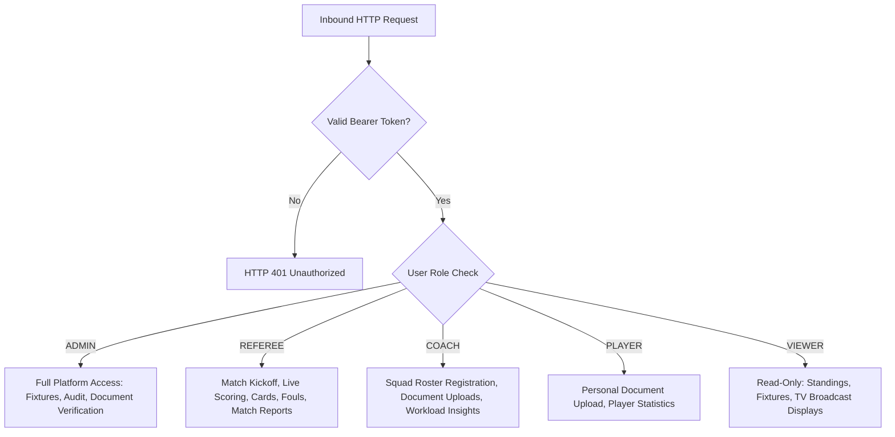

# ArenaSync — Threat Model & Security Architecture (BIT-57)

This document provides the formal STRIDE threat modeling analysis and defense-in-depth security controls implemented in **ArenaSync**.

---

## 1. STRIDE Threat Matrix & Mitigation Summary

| STRIDE Category | Threat Description | Severity | ArenaSync Mitigation Mechanism | Implemented Verification |
|---|---|---|---|---|
| **Spoofing (Authentication)** | An attacker impersonates a referee or administrator to alter live match scores or verify documents. | **HIGH** | Role-based Bearer token authentication (`authenticate` middleware) validating cryptographic signatures and session claims. | `tests/auth.test.js` (rejects forged/expired tokens with HTTP 401). |
| **Tampering (Integrity)** | Multiple concurrent officials overwrite live scores, causing lost updates or negative values. | **HIGH** | Optimistic Concurrency Control (`expectedVersion === match.version`), HTTP 409 Conflict rejection, input validation guards ($\text{score} \ge 0$), and match completion locks. | `tests/scoring_and_concurrency.test.js`, `scripts/evaluate-performance.js`. |
| **Repudiation (Auditability)** | A rogue administrator or referee denies modifying a tournament rule or clearing an ineligible athlete. | **MEDIUM** | Centralized, immutable append-only audit stream (`AuditLogEntry`) capturing actor ID, user role, action type, entity ID, and state diffs. | `tests/audit_logs.test.js` (ensures unalterable before/after diffs). |
| **Information Disclosure** | Leakage of server stack details via headers or exposure of student-athlete medical documentation. | **MEDIUM** | `x-powered-by` header removal, strict HTTP security headers (`nosniff`, `SAMEORIGIN`), and role-restricted document verification endpoints. | `scripts/security-audit.js`, `tests/security.test.js`. |
| **Denial of Service (Availability)** | Excessive request payloads crash the Node.js event loop or overwhelm API endpoints. | **HIGH** | JSON body parser payload bound capped at `2mb` (`express.json({ limit: '2mb' })`), and rate-limiting bounds (`server/security.ts`). | `server.ts`, `server/security.ts`, `scripts/evaluate-performance.js`. |
| **Elevation of Privilege** | A spectator or coach attempts to access administrative endpoints (`/api/audit-logs`, `/api/tournaments`). | **CRITICAL**| Multi-tier role-based access control (`requireRole('ADMIN')`, `requireRole('ADMIN', 'REFEREE')`), returning HTTP 403 Forbidden. | `tests/auth.test.js` (evaluates VIEWER, COACH, PLAYER restrictions). |

---

## 2. In-Depth Security Analysis

### 2.1. Authentication & Session Management
* **Token Structure**: `arenasync-jwt-<userId>-<base64Payload>` encodes user identity, role, and issuance timestamp.
* **Validation**: Request headers (`Authorization: Bearer <token>`) are parsed and cross-referenced against the active in-memory user registry. Missing, malformed, or tampered tokens result in immediate `HTTP 401 Unauthorized` responses before reaching route handlers.

### 2.2. Role-Based Access Control (RBAC)
ArenaSync enforces least-privilege role boundaries across 5 distinct personas:

### 2.3. Concurrency Protection & Race Condition Elimination
* **Vulnerability**: Distributed, simultaneous live score submissions from stadium table officials can cause lost updates under naive last-write-wins (LWW) architectures.
* **Defense**: ArenaSync implements **Optimistic Concurrency Control (OCC)**. Each match entity maintains an atomic integer `version` field. When a mutation request is submitted:
  1. The server checks `if (match.version !== expectedVersion)`.
  2. If mismatched, the server rejects the write with `HTTP 409 Conflict`, returning the current state.
  3. If matched, the server commits the score, appends an event, and atomically increments `version: N -> N + 1`.

### 2.4. HTTP Security Headers & Fingerprint Suppression
Implemented via `server/security.ts`:
* `X-Content-Type-Options: nosniff`: Prevents MIME-type sniffing attacks.
* `X-Frame-Options: SAMEORIGIN`: Defends against UI redressing and clickjacking.
* `X-XSS-Protection: 1; mode=block`: Activates browser XSS filtering.
* `Referrer-Policy: strict-origin-when-cross-origin`: Mitigates credential leakage in HTTP referrers.
* `app.disable('x-powered-by')`: Suppresses backend framework fingerprinting to obstruct targeted CVE exploits.

### 2.5. Secrets & Credential Protection
* **Policy**: Zero hardcoded secrets in version control.
* **Enforcement**: `.gitignore` strictly rejects `.env*` files (allowing only `.env.example`).
* **Automated Audit**: `npm run security:check` scans disk for forbidden credential files (`id_rsa`, `.env.local`, `.pem`) and validates package dependency CVE advisories before deployment.

### 2.6. Athlete Data Privacy & Ethical Scientific Disclaimers
* **Student Privacy**: Athlete contact numbers and medical certificates are strictly gated from public `VIEWER` access.
* **Clinical Disclaimer**: To prevent misinterpretation of fatigue metrics as medical diagnoses, all workload and injury endpoints explicitly include the mandatory disclaimer:
  > *"All flags and risk tiers are statistical workload & fatigue models, NOT medical diagnoses."*
