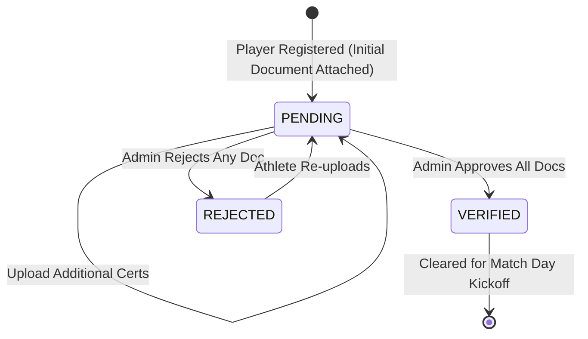

# ArenaSync — End-User Operations Guide (BIT-57)

Welcome to the **ArenaSync User Guide**. ArenaSync is a smart sports tournament operations, live scoring, and athlete workload analytics platform designed for collegiate tournaments, athletic directors, referees, coaches, athletes, and spectators.

---

## 1. Getting Started

### 1.1. Starting ArenaSync Locally
Make sure you have Node.js (v20.x or v22.x LTS) installed. In your terminal:

```bash
# 1. Install dependencies
npm install

# 2. Start the development server
npm run dev
```

### 1.2. Accessing the Application in Your Web Browser
Open your web browser and navigate to:
```
http://localhost:3000
```

### 1.3. User Authentication & Role Selection
ArenaSync implements role-based authentication. In the top navigation bar, use the **Persona Switcher** to log in as one of the pre-configured accounts or authenticate via the login modal:
* **Admin**: `Prof. David Vance` (`admin@smartsports.edu`)
* **Referee**: `Marcus Webb` (`referee@smartsports.edu`)
* **Coach**: `Elena Rostova` (`coach@titanfc.edu`)
* **Player**: `Julian Reyes` (`player@titanfc.edu`)
* **Viewer**: `Campus Spectator` (`viewer@smartsports.edu`)

---

## 2. User Roles & Permissions Matrix

ArenaSync strictly enforces Role-Based Access Control (RBAC):

| User Role | Persona | What You Can Do | What You Cannot Do |
|---|---|---|---|
| **ADMIN** | Tournament Director | Create tournaments, generate fixture brackets, verify/reject athlete documents, audit governance logs, reset demo data. | Cannot alter finalized match scores once marked `COMPLETED`. |
| **REFEREE** | Match Official | Start assigned matches, record live scores, log yellow/red cards and fouls, submit final match reports. | Cannot generate tournament brackets, modify team registrations, or verify eligibility documents. |
| **COACH** | Team Head Coach | Register squad players, upload player eligibility documents, view team workload & injury risk analytics. | Cannot officiate live match scoring or approve eligibility documents. |
| **PLAYER** | Student-Athlete | Upload personal eligibility certificates (Student ID, Medical clearance), view personal match stats. | Cannot approve documents, register teams, or modify scores. |
| **VIEWER** | Campus Spectator / Media | View live standings, tournament fixtures, top scorer leaderboards, and TV broadcast view. | Read-only access; cannot execute mutations or view private audit logs. |

---

## 3. Team Registration & Management

### 3.1. Registering a Team (Admin Only)
1. Navigate to the **Teams** tab from the sidebar.
2. Click **+ Register New Team**.
3. Fill in required fields:
   * **Team Name** (e.g., `Titan FC`)
   * **Team Code** (Unique 3-letter code, e.g., `TIT`)
   * **Head Coach Name & Email**
   * **Home Venue & Colors**
4. Click **Save Team**.

### 3.2. Validation Rules
* **Unique Name & Code**: The system checks for duplicate team names and codes (case-insensitive). Submitting a duplicate will display an error (`A team with this name or code already exists`).
* **Required Fields**: Name and 3-letter code are mandatory.

---

## 4. Athlete Eligibility & Document Verification

To ensure academic and institutional compliance, student-athletes must undergo document verification before taking the field.



### 4.1. Uploading Documents (Coach & Player)
1. Navigate to the **Documents** or **Players** tab.
2. Select the student-athlete and click **Upload Certificate**.
3. Select document type (`COLLEGE_ID`, `MEDICAL_CERTIFICATE`, `ID_PROOF`, or `REGISTRATION_DOC`).
4. Submit the file. The document status transitions to `PENDING`.

### 4.2. Reviewing & Approving Documents (Admin Only)
1. Navigate to the **Documents Desk**.
2. Filter by status (`PENDING`).
3. Click **Verify Document** or **Reject**.
4. Enter optional verification notes.

### 4.3. Kickoff Clearance Gate
* **All Documents Verified**: Athlete eligibility status transitions to `VERIFIED` (Green badge).
* **Incomplete / Pending**: If even one required document is `PENDING` or `REJECTED`, the athlete is filtered out and blocked from match kickoff squad selection.

---

## 5. Tournament Fixtures & Knockout Brackets

### 5.1. Viewing Fixtures
Navigate to the **Fixtures** tab to view scheduled, live, and completed matches across all tournament rounds.

### 5.2. Single-Elimination Knockout Progression
For an 8-team tournament, ArenaSync automatically structures a 3-round bracket:
1. **Round 1 (Quarter-Finals)**: 4 matches featuring the 8 seeded teams (`match-qf-1` to `match-qf-4`).
2. **Round 2 (Semi-Finals)**: 2 matches (`match-sf-1`, `match-sf-2`). The winners of QF1 & QF2 automatically advance to SF1; winners of QF3 & QF4 advance to SF2.
3. **Round 3 (Championship Final)**: 1 match (`match-fn-1`). The winners of SF1 & SF2 contest the championship trophy.

---

## 6. Referee Live Console & Match Management

### 6.1. Starting a Match (Referee / Admin)
1. Log in as a **REFEREE** or **ADMIN**.
2. Navigate to **Referee Console** or **Live Scoring**.
3. Select an assigned fixture with status `SCHEDULED`.
4. Click **Start Match (Kickoff)**. The match transitions to `LIVE` and the match clock begins.

### 6.2. Recording In-Game Incidents
During a live match, referees can record:
* **Goals**: Click `+ Goal`, specify scoring team and player.
* **Disciplinary Cards**: Log Yellow Cards (`🟨`) or Red Cards (`🟥`).
* **Fouls & Substitutions**: Record in-game tactical events.

---

## 7. Live Scoring & Concurrency Control

### 7.1. Atomic Live Score Updates
1. On the **Live Scoring** screen, click `+1` on the Home or Away team score.
2. ArenaSync validates that the score is non-negative ($\ge 0$) and updates the live scoreboard.

### 7.2. Understanding Concurrency Conflicts (`HTTP 409 Conflict`)
In high-stakes tournament environments, multiple officials or assistant referees might attempt to input scores simultaneously from different devices.
* **What Happens**: ArenaSync uses **Optimistic Concurrency Control (OCC)** with atomic version counters (`v1 -> v2`).
* **Conflict Notice**: If another official submitted a score one millisecond before you, your screen will display:
  > *"Concurrency conflict: Match state was updated by another official. Reloading latest score."*
* **Why this is safe**: This prevents **lost updates** (silent overwriting of goal events). The system automatically refreshes your interface to the true server state.

### 7.3. Match Completion & Lifecycle Lock
When the referee clicks **Full-Time (Complete Match)**:
* Final scores are immutably sealed.
* Any further attempt to modify the score is strictly rejected (`Score is locked because this match is marked COMPLETED`).
* Tournament standings and bracket progressions are automatically updated.

---

## 8. Championship Standings Table

Navigate to the **Standings** tab to view the live championship table.

### 8.1. Points System
* **Win**: 3 Points
* **Draw**: 1 Point
* **Loss**: 0 Points

### 8.2. Ranking Hierarchy
Teams are automatically ranked by:
1. **Total Points** (Highest first)
2. **Goal Difference** ($\text{Goals For} - \text{Goals Against}$)
3. **Goals For** (Total goals scored)

---

## 9. Workload Analytics (ACWR)

Navigate to the **Workload** tab to monitor athlete fatigue accumulation.

### 9.1. Simple Explanation of ACWR
The **Acute:Chronic Workload Ratio (ACWR)** compares an athlete's short-term match stress against their historical training foundation:
* **Acute Workload (7 Days)**: Match minutes played over the past week (fatigue indicator).
* **Chronic Workload (28 Days)**: Average weekly match minutes over the past month (fitness/conditioning indicator).
* **Ratio**: $\text{ACWR} = \frac{\text{Acute Load}}{\text{Chronic Load}}$

### 9.2. Workload Tiers
* **LOW ($<0.80$)**: Under-loaded / reduced match minutes.
* **NORMAL ($0.80\text{--}1.30$)**: **Gabbett "Sweet Spot"** — optimal conditioning with progressive load.
* **HIGH ($1.30\text{--}1.49$)**: Elevated training stress; monitor recovery.
* **VERY HIGH ($\ge 1.50$)**: High fatigue spike; elevated risk of strain.

---

## 10. Proactive Injury-Risk Flags

Navigate to the **Injury Flags** tab to review statistical fatigue signals.

### 10.1. Risk Levels & Triggers
* **LOW RISK**: Workload within normal conditioning bounds ($0.80 \le \text{ACWR} \le 1.30$).
* **MODERATE RISK**: Triggered by ACWR between $1.35\text{--}1.49$ or compressed recovery window ($<24\text{ hours}$ between fixtures).
* **HIGH RISK**: Triggered by an acute workload spike ($\text{ACWR} \ge 1.50$) combined with fixture congestion ($\ge 3\text{ matches}$ or $\ge 180\text{ minutes}$ in $48\text{ hours}$).

> [!CAUTION]
> **Important Scientific Disclaimer**: All injury-risk flags are statistical workload heuristics to assist coaches in squad rotation. They are **NOT** medical diagnoses.

---

## 11. Immutable Audit Trail

Navigate to the **Audit Logs** tab (Admin role required) to inspect governance records.
* **What is Logged**: User logins, team registrations, athlete document verifications, score modifications, match kickoff/completion, and ACWR alerts.
* **Information Recorded**: ISO timestamp, User ID, User Name, Role, Action Type, Entity ID, and before/after state deltas.

---

## 12. Troubleshooting Guide

| Issue / Error Message | Root Cause | Resolution |
|---|---|---|
| **"Authentication required. Please provide a valid Bearer token"** | No active session or token expired. | Select a user persona from the top navigation bar or log in. |
| **"Forbidden: User role 'COACH' is not authorized"** | You attempted an action restricted to another role (e.g. Admin/Referee). | Switch to an authorized persona (`ADMIN` for brackets/verifications, `REFEREE` for live scoring). |
| **"Concurrency conflict: Match state was updated by another user"** | Another official submitted a score update simultaneously. | The app will automatically re-fetch the latest score; re-apply your intended adjustment if still needed. |
| **"Scores cannot be negative"** | A score value $<0$ was entered. | Enter non-negative integers only ($\ge 0$). |
| **"Score is locked because this match is marked COMPLETED"** | Attempted to modify score on a sealed match. | Completed match scores are final and immutable by design. |
| **"Player not cleared for match day kickoff"** | The athlete has `PENDING` or `REJECTED` documents. | Ask the Administrator to verify all outstanding documents in the Documents Desk. |

---

## 13. Known Limitations

* **In-Memory Storage**: Data resides in the in-memory transactional database. If the server process is restarted without persistent database configuration, data reverts to the initial demo seed.
* **Decision Support Only**: Workload (ACWR) and injury-risk flags are statistical models to support coaching decisions, not clinical diagnoses.
